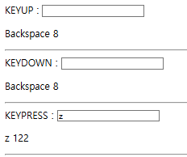

# 01

> **03_키보드.html**
> 



```jsx
<!DOCTYPE html>
<html lang="en">

<head>
    <meta charset="UTF-8">
    <meta name="viewport" content="width=device-width, initial-scale=1.0">
    <title>Document</title>
</head>

<body>
    KEYUP : <input id="input1"><br>
    <p id="p1"></p>
    <hr>
    KEYDOWN : <input id="input2"><br>
    <p id="p2"></p>
    <hr>
    KEYPRESS : <input id="input3"><br>
    <p id="p3"></p>
    <hr>

    <script>
        //KEYUP         : 키보드가 올라올때
        const keyupEl = document.querySelector('#input1')
        const p1El = document.querySelector('#p1')
        keyupEl.addEventListener('keyup', (e) => {
            console.log('keyup', e)
            console.log('keyup', e.key)
            console.log('keyup', e.keyCode)
            p1El.innerHTML = e.key + " " + e.keyCode;
        })
        //KEYDOWN       : 키보드가 내려갈때 
        const keydownEl = document.querySelector('#input2')
        const p2El = document.querySelector('#p2')
        keydownEl.addEventListener('keydown', (e) => {
            console.log('keydown', e)
            console.log('keydown', e.key)
            console.log('keydown', e.keyCode)
            p2El.innerHTML = e.key + " " + e.keyCode;
        })
        //KEYPRESS      : 키보드를 계속 누를때
        const keypressEl = document.querySelector('#input3')
        const p3El = document.querySelector('#p3')
        keypressEl.addEventListener('keypress', (e) => {
            console.log('keypress', e)
            console.log('keypress', e.key)
            console.log('keypress',e.keyCode)
            p3El.innerHTML = e.key + " " + e.keyCode;
        }) 
    </script>
</body>

</html>
```

---

> **04_키보드.html**
> 


```jsx
<!DOCTYPE html>
<html lang="en">
<head>
    <meta charset="UTF-8">
    <meta name="viewport" content="width=device-width, initial-scale=1.0">
    <title>Document</title>
</head>
<body>
    INPUT EVENT : <input id="input1"><br>
    <p id="p1"></p>
    <hr>
    COMPOSITIONSTART EVENT : <input id="input2"><br>
    <p id="p2"></p>
    <hr>
    COMPOSITIONUPDATE EVENT : <input id="input3"><br>
    <p id="p3"></p>
    <hr>
    COMPOSITIONEND EVENT : <input id="input4"><br>
    <p id="p4"></p>
    <hr>
    <script>
        //input             : 텍스트 입력이 완료될때 발생(한글포함)
        const inputEl = document.querySelector('#input1')
        const p1El = document.querySelector('#p1')
        inputEl.addEventListener('input', (e) => {
            console.log('input', e)
            console.log('input', e.data)
            p1El.innerHTML = e.data;
        })
        //compositionstart  : 한글 조합 시작시 발생
        const compositionstartEl = document.querySelector('#input2')
        const p2El = document.querySelector('#p2')
        compositionstartEl.addEventListener('compositionstart', (e) => {
            console.log('compositionstart', e)
            console.log('compositionstart', e.target.value)
            p2El.innerHTML = e.data;
        })
        //compositionupdate : 한글 조합 중 발생(현재 조합 상태를 확인)
        const compositionupdateEl = document.querySelector('#input3')
        const p3El = document.querySelector('#p3')
        compositionupdateEl.addEventListener('compositionupdate', (e) => {
            console.log('compositionupdate', e)
            console.log('compositionupdate', e.target.value)
            p3El.innerHTML = e.data;
        })
        //compositionend    : 한글 조합 완료시 발생(완성된 글자 확인)
        const compositionendEl = document.querySelector('#input4')
        const p4El = document.querySelector('#p4')
        compositionendEl.addEventListener('compositionend', (e) => {
            console.log('compositionend', e)
            console.log('compositionend', e.target.value)
            p4El.innerHTML = e.data;
        })

    </script>
    
</body>
</html>
```

---

> **05_채팅창.html**
> 


```jsx
<!DOCTYPE html>
<html lang="en">

<head>
    <meta charset="UTF-8">
    <meta name="viewport" content="width=device-width, initial-scale=1.0">
    <title>Document</title>
</head>

<body>

    KEYDOWN : <input id="input2"><br>
    <p id="p2"></p>
    <hr>
    <script>
        const keydownEl = document.querySelector('#input2')
        const p2El = document.querySelector('#p2')
        keydownEl.addEventListener('keydown', (e) => {
            console.log('keydown', e)
            console.log('keydown', e.key)
            console.log('keydown', e.keyCode)
            // p2El.innerHTML = e.key + " " + e.keyCode;
            if(e.keyCode===13){
                const text = keydownEl.value;
                const newEl = document.createElement('div');
                newEl.innerHTML=text;
                p2El.prepend(newEl);
                keydownEl.value="";
            }

        })
    </script>
</body>

</html>
```

---

> **06_타자연습.html**
> 


```jsx
<!DOCTYPE html>
<html lang="en">

<head>
    <meta charset="UTF-8">
    <meta name="viewport" content="width=device-width, initial-scale=1.0">
    <title>Document</title>
    <!-- GOOGLE ICON -->
    <link rel="stylesheet"
        href="https://fonts.googleapis.com/css2?family=Material+Symbols+Outlined:opsz,wght,FILL,GRAD@20..48,100..700,0..1,-50..200&icon_names=local_shipping" />
    <style>
        .material-symbols-outlined {
            font-variation-settings:
                'FILL' 0,
                'wght' 400,
                'GRAD' 0,
                'opsz' 24
        }
    </style>

    <style>
        .container {
            width: 800px;
            margin: 100px auto;
        }

        .container>* {
            margin-bottom: 20px;
        }

        .container>h1 {
            text-align: center;
        }

        .container>#target-text {
            font-size: 1.5rem;
            text-align: left;
        }

        .container>input[type="text"] {
            width: 100%;
            height: 35px;
            font-size: 1.2rem;
        }

        .container>#result {
            font-size: 1.5rem;
            text-align: left;
            min-height: 30px;
        }

        .valid {
            color: green;
        }

        .invalid {
            color: red;
        }
        #percentage{
            border : 1px solid;
            width  : 500px;
            padding : 2px;
            position:relative;
            height : 22px;
        }
        #percentage span{
            width : 25px;
            position:absolute;
            /* left:calc(100%  - 25px); */
            left:0;
            transition: .7s;
        }
    </style>
</head>

<body>

    <div class="container">
        <h1>타자연습</h1>
        <div id="target-text"></div>
        <div id="result">입력된 값이 올바른지 여부를 확인하는 부분입니다</div>
        <input type="text" id="input-text" placeholder="위 문장을 입력하세요" />
        <div id="percentage">
            <span class="material-symbols-outlined">local_shipping</span>
        </div>

    </div>
    <script>
        //요소 찾기
        const targetTextEl = document.querySelector('#target-text');
        const resultEl = document.querySelector('#result');
        const inputEl = document.querySelector('#input-text');

        //문장 배열
        const texts = [
            "묻고 더블로 가!",
            "꼭 그렇게 모두 가져가야만 속이 후련했냐",
            "신에게는 아직 12척의 배가 남아 있사옵니다",
            "아직 한발 남았다",
            "HTML/CSS/JS 공부중입니다. 생각보다 쉽진않지만 재미지죠?",
            "아니면 어쩔수없죠.... 재밌다고 생각하면 재밌는겁니다",
        ]
        let textsIdx = parseInt(Math.random() * 100) % texts.length;
        console.log(textsIdx);
        targetTextEl.innerHTML=texts[textsIdx];

        //문장 랜덤 배치

        //이벤트 처리

        //하나씩 확인
        inputEl.addEventListener('input', (e) => {
            //일치여부 체크 
            const text = texts[textsIdx];

            //일치하는 문자개수 저장
            let validCnt = 0;
            //result에 입력한 내용 표시(OK : green , X : red)
            let resultHTML = '';
            const inputedValue = inputEl.value;
            // console.log(inputedValue);
            // console.log(e.data);
            for (let i = 0; i < inputedValue.length; i++) {
                // console.log(`input ${i}`,inputedValue[i],'길이',inputedValue.length);
                if (i >= text.length) {
                    //문장길이를 초과하는 inputedValue
                    resultHTML += `<span class='invalid'>${inputedValue[i]}</span>`
                }
                else if (text[i] !== inputedValue[i]) {
                    resultHTML += `<span class='invalid'>${inputedValue[i]}</span>`
                }
                else {
                    resultHTML += `<span class='valid'>${inputedValue[i]}</span>`
                    validCnt++;
                }
            }

            resultEl.innerHTML = resultHTML;
            //문장완성도를 백분율로 환산
            console.log('전체문자열길이 : ',text.length,'옳게입력한 문자개수 :',validCnt);
            const progressPercent =  (validCnt / text.length) * 100;
            const progressIconEl = document.querySelector('#percentage span');
            if(progressPercent !== 100)
                progressIconEl.style.left=`${progressPercent}%`;
            else
                progressIconEl.style.left=`calc(${progressPercent}% - 25px)`;
            
            //문장 전체 일치여부 확인
            if (text === inputedValue) {

                // 지연시간 -> setTimeout()
                setTimeout(() => {

                    inputEl.disabled = true;
                    //문장배열의 길이를 초과하는 경우 다시 0 idx로 설정
                    // textsIdx = (textsIdx + 1 >= texts.length) ? 0 : textsIdx + 1;

                    //다음으로 나오는 문장이 그전에 봤던 문장과 겹치지 않도록 index설정
                    while(true){
                        tmp=parseInt(Math.random() * 100) % texts.length;
                        if(tmp!==textsIdx){
                            textsIdx = tmp;
                            break;
                        }
                    }
                    

                    targetTextEl.innerHTML = texts[textsIdx];
                    inputEl.value = "";
                    resultEl.innerHTML = "";

                    inputEl.disabled = false;
                    inputEl.focus();

                    //자동차아이콘 left : 0;
                    progressIconEl.style.left=`0`;
                }, 1000);

            }

        })

        // //조합된 문장전체 일치여부
        // inputEl.addEventListener('compositionupdate',(e)=>{
        //     const inputedValue = inputEl.value;
        //     console.log('compositionupdate',e);
        //     console.log('inputedValue',inputedValue);
        // })
    </script>
</body>

</html>
```

---

> **07_Check이벤트.html**
> 


```jsx
<!DOCTYPE html>
<html lang="en">
<head>
    <meta charset="UTF-8">
    <meta name="viewport" content="width=device-width, initial-scale=1.0">
    <title>Document</title>
</head>
<body>
    <div class="chk-block">
        <input type="checkbox" id="chk">
        <label for="chk">체크박스</label>
    </div>

    <script>
        const chkEl = document.querySelector('#chk');
        chkEl.addEventListener('change',(e)=>{
            console.log('change...',e);
            if(e.target.checked)
                document.querySelector(".chk-block label").style.color="red";
            else
                document.querySelector(".chk-block label").style.color="black";
        });

    </script>

</body>
</html>
```

---

> **08_[문제]표만들기.html**
> 


```jsx
<!DOCTYPE html>
<html lang="en">

<head>
    <meta charset="UTF-8">
    <meta name="viewport" content="width=device-width, initial-scale=1.0">
    <title>Document</title>
    <style>
        td {
            width: 50px;
            height: 50px;
            border: 1px solid gray;
        }

        input {
            width: 90%;
            height: 100%;
            outline: none;
            border: 0px;
        }
    </style>

</head>

<body>

    <input id="rownum" placeholder="행의개수입력" style="width:200px;">
    <input id="colnum" placeholder="열의개수입력" style="width:200px;">
    <button onclick="makemap()">생성</button>
    <hr>
    <table id="tbl">
        <tbody>

        </tbody>
    </table>
    <script>

        //State 
        let curX = 0;
        let curY = 0;
        let selectedNode = null;

        //
        const selectedStyle = (xPos, yPos) => {
            console.log(xPos, yPos);
            if (selectedNode) {
                //이전에 선택된 노드가 있는경우
                deSelectedStyle(selectedNode);
            }
            // 이전에 선택된 노드가 있는경우
            selectedNode = document.getElementById(`${xPos}|${yPos}`);
            selectedNode.style.backgroundColor = 'grey';
        }
        const deSelectedStyle = (node) => {
            node.style.backgroundColor = 'white';
        }

        const makemap = () => {
            const row = document.querySelector('#rownum').value; //tr 개수
            const col = document.querySelector('#colnum').value; //td 개수
            const tbodyEl = document.querySelector('#tbl tbody');

            while (tbodyEl.firstChild) {
                tbodyEl.removeChild(tbodyEl.firstChild)
            }

            console.log('row', row, 'col', col);
            for (let i = 0; i < row; i++) {
                const trEl = document.createElement('tr');
                for (let j = 0; j < col; j++) {
                    const tdEl = document.createElement('td');

                    tdEl.addEventListener('click', (e) => {
                        console.log('클릭node', tdEl);
                        const id = tdEl.getAttribute('id');
                        const xPos = id.split('|')[0];
                        const yPos = id.split('|')[1];
                        selectedStyle(xPos, yPos);

                    })
                    tdEl.innerHTML = `(${j},${i})`;
                    // tdEl.setAttribute('data-row',i);
                    // tdEl.setAttribute('data-col',j);
                    tdEl.setAttribute('id', `${j}|${i}`);
                    trEl.appendChild(tdEl);

                }
                tbodyEl.appendChild(trEl);
            }

            //기본 cur 위치
            curX = Math.ceil(col / 2 - 1);
            curY = Math.ceil(row / 2 - 1);
            //초기 선택된 위치 스타일링
            selectedStyle(curX, curY);
        }
    </script>
</body>

</html>
```

---

> **09_스크롤.html**
> 


```jsx
<!DOCTYPE html>
<html lang="en">
<head>
    <meta charset="UTF-8">
    <meta name="viewport" content="width=device-width, initial-scale=1.0">
    <title>Document</title>
</head>
<body style="height: 5000px; margin: 0;padding: 0;width: 8000px;">
    <script>
        document.addEventListener('scroll',(e)=>{
            // ----------------------------
            // 세로 축 확인
            // ----------------------------
            console.log('scroll...',window.scrollY)
            // console.log('scroll...',document.documentElement.scrollHeight)
            // console.log('scroll...',document.documentElement.scrollTop)

            // ----------------------------
            // 가로 축 확인
            // ----------------------------
            console.log('scroll...',window.scrollX)
            // console.log('scroll...',document.documentElement.scrollWidth)
            // console.log('scroll...',document.documentElement.scrollLeft)
        })
    </script>
    
</body>
</html>
```

---

> **10_Resize.html**
> 


```jsx
<!DOCTYPE html>
<html lang="en">
<head>
    <meta charset="UTF-8">
    <meta name="viewport" content="width=device-width, initial-scale=1.0">
    <title>Document</title>
    <style>
        .ball{
            border : 1px solid;
            min-width:50px;
            min-height:50px;
            border-radius: 50%;
            position:absolute;
            left:0;right:0;
            top:0;bottom:0;
            margin:auto;
            transition: .8s;
        }
        .ball-1280px{
            width : 300px;
            height : 300px;
            border : 5px solid;
            background-color: green;
        }
        .ball-768px{
            width : 150px;
            height : 150px;
            border : 3px solid;
            background-color: orange;
        }
        .ball-480px{
            width : 100px;
            height : 100px;
            border : 1px solid;
            background-color: royalblue;
        }
    </style>
</head>
<body>
    
    <div class="ball ball-1280px"></div>

    <script>
        
        window.addEventListener('resize',()=>{
            // console.log('외부 크기 변화 width확인,',window.outerWidth);
            // console.log('외부 크기 변화 height확인,',window.outerHeight);
            console.log('내부 크기 변화 width확인,',window.innerWidth);
            console.log('내부 크기 변화 height확인,',window.innerHeight);
            const width = window.innerWidth;

            const ballEl = document.querySelector('.ball');
            if(width<768)
            {
                //모바일 처리
                ballEl.className='ball ball-480px';
            }
            else if(width<1280)
            {
                //태블릿 처리
                ballEl.className='ball ball-768px';
            }
            else
            {
                //데스크탑 처리
                ballEl.className='ball ball-1280px';
            }
        })

    </script>
</body>
</html>
```

---

> **11_DOMLOAD.html**
> 


```jsx
<!DOCTYPE html>
<html lang="en">

<head>
    <meta charset="UTF-8">
    <meta name="viewport" content="width=device-width, initial-scale=1.0">
    <title>Document</title>
    <style>
        .ball {
            border: 1px solid;
            min-width: 50px;
            min-height: 50px;
            border-radius: 50%;
            position: absolute;
            left: 0;
            right: 0;
            top: 0;
            bottom: 0;
            margin: auto;
            transition: .8s;
        }

        .ball-1280px {
            width: 300px;
            height: 300px;
            border: 5px solid;
            background-color: green;
        }

        .ball-768px {
            width: 150px;
            height: 150px;
            border: 3px solid;
            background-color: orange;
        }

        .ball-480px {
            width: 100px;
            height: 100px;
            border: 1px solid;
            background-color: royalblue;
        }
    </style>
</head>

<body>

    <div class="ball ball-1280px"></div>

    <script>

        //---------------------
        //Load이벤트
        //---------------------
        //DOMContentLoaded  : 최초 Document 로드시 1회 동작(HTML이 전부 파싱된 이후 DOM객체가 완성되고 나서 실행,CSS,외부파일 로드여부와는 관계없다)
        //load              : 최초 Document 로드시 1회 동작(모든 리소스가 완전히 로드된 이후 실행)

        
        window.addEventListener('DOMContentLoaded', () => {

            // 반응처리함수
            const flexibleBall = (width,ballEl) => {
                if (width < 768) {
                    //모바일 처리
                    ballEl.className = 'ball ball-480px';
                }
                else if (width < 1280) {
                    //태블릿 처리
                    ballEl.className = 'ball ball-768px';
                }
                else {
                    //데스크탑 처리
                    ballEl.className = 'ball ball-1280px';
                }
            }
            const width = window.innerWidth;
            const ballEl = document.querySelector('.ball');
            flexibleBall(width,ballEl);

            window.addEventListener('resize', () => {
                const width = window.innerWidth;
                const ballEl = document.querySelector('.ball');
                flexibleBall(width,ballEl);
            })

            // DOMLOAD EVENT
        })

    </script>
</body>

</html>
```