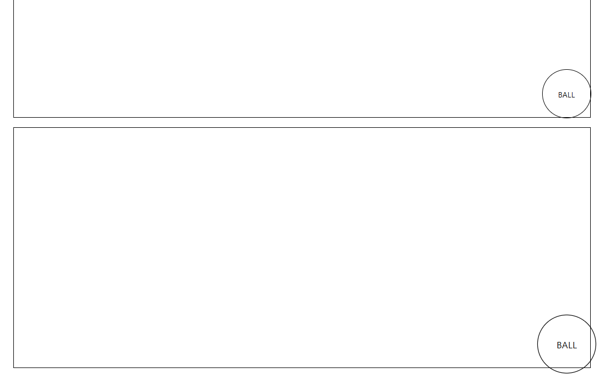

# 01

> **SCROLLMAGIC 02.html**
> 



```jsx
<!DOCTYPE html>
<html lang="en">

<head>
    <meta charset="UTF-8">
    <meta name="viewport" content="width=device-width, initial-scale=1.0">
    <title>Document</title>

    <!-- SCROLLMAGIC CDN -->
    <script src="https://cdnjs.cloudflare.com/ajax/libs/ScrollMagic/2.0.8/ScrollMagic.min.js"
        integrity="sha512-8E3KZoPoZCD+1dgfqhPbejQBnQfBXe8FuwL4z/c8sTrgeDMFEnoyTlH3obB4/fV+6Sg0a0XF+L/6xS4Xx1fUEg=="
        crossorigin="anonymous" referrerpolicy="no-referrer"></script>

    <style>
        section {
            width: 1200px;
            margin: 0 auto;
            height: 500px;
            border: 1px solid;
            margin-bottom: 20px;

            position: relative;
        }

        .ball {
            width: 100px;
            height: 100px;
            border: 1px solid;
            border-radius: 50%;

            display: flex;
            justify-content: center;
            align-items: center;

            position: absolute;
            left: 0;
            top: 0;
            transition: .5s;
        }

        .move {
            left: calc(100% - 100px);
            top: calc(100% - 100px);
        }
        .move2{
            left: calc(100% - 100px);
            top: calc(100% - 100px);
            transform: rotate(360deg) scale(1.2);
            transition: .2s;
        }
    </style>
</head>

<body>

    <section></section>

    <section class="scroll-section scroll-spy first">
        <div class="ball">BALL</div>
    </section>
    <section class="scroll-section scroll-spy second">
        <div class="ball">BALL</div>
    </section>
    <section></section>

    <script>
        const spyedEls = document.querySelectorAll('.scroll-spy');
        spyedEls.forEach((el) => {
            console.log(el)
            const ballEl = el.querySelector('.ball')
            if (el.classList.contains('first')) {
                new ScrollMagic.Scene({
                    triggerElement: el,
                    triggerHook: .5,
                })
                    .setClassToggle(ballEl, 'move')
                    .addTo(new ScrollMagic.Controller());

            } else if (el.classList.contains('second')) {
                new ScrollMagic.Scene({
                    triggerElement: el,
                    triggerHook: .5,
                })
                    .setClassToggle(ballEl, 'move2')
                    .addTo(new ScrollMagic.Controller());
            }
        })

        // const scrollMagicObj = new ScrollMagic.Scene({
        //                                 triggerElement : spyedEl,   //감시할 요소 선택
        //                                 triggerHook : .5,           //스크롤의 위치값(0-1, 0:최상단,.5:화면중앙,1:화면최하단)
        //                             })
        //                             .setClassToggle(ballEl,'move')  //Hook대상EL , 효과적용 class명
        //                             .addTo(new ScrollMagic.Controller());
    </script>
</body>

</html>
```

---

> **GSAP 01.html**
> 


```jsx
<!DOCTYPE html>
<html lang="en">
<head>
    <meta charset="UTF-8">
    <meta name="viewport" content="width=device-width, initial-scale=1.0">
    <title>Document</title>
 <!-- 참고 : https://lpla.tistory.com/106 -->

    <style>
        .box{ margin: 20px; width: 100px; height: 100px; }
        .box1{ background: orange; }
        .box2{ background: greenyellow; }
        .box3{ background: tomato; }
    </style>

    <script src="https://cdnjs.cloudflare.com/ajax/libs/gsap/3.9.1/gsap.min.js"></script>

</head>
<body>

    <div class="box box1"></div>
    <div class="box box2"></div>
    <div class="box box3">box</div>

   
    <script>
        // GSAP 라이브러리를 사용하여 애니메이션을 만듭니다.
        gsap.to(".box1", { duration: 3, x: 200, y:200,opacity: 0.2, ease: 'steps(10)', delay: 2,});
        gsap.to(".box2", { duration: 3, x: 200, rotate: 720, scale: 1.3,});
        gsap.to(".box3", { duration: 3, x: 200, ease: 'elastic', backgroundColor: 'red', width: 300, fontSize: 60});
        
    </script>
</body>
</html>
```

---

> **CHART 01.html**
> 


```jsx
<!DOCTYPE html>
<html lang="en">

<head>
    <meta charset="UTF-8">
    <meta name="viewport" content="width=device-width, initial-scale=1.0">
    <title>Document</title>

    <!-- CHART JS -->
    <script src="https://cdn.jsdelivr.net/npm/chart.js"></script>
</head>

<body>

    <div style="width:800px;height : 500px; border : 1px solid;">
        <canvas id="myChart"></canvas>
    </div>

    <script>
        const ctx = document.getElementById('myChart');

        let data = {
            labels: ['Red', 'Blue', 'Yellow', 'Green', 'Purple', 'Orange'],
            datasets: [

                // {
                //     label: 'TEST_LABEL',
                //     data: [12, 28, 3, 5, 2, 3],
                //     borderWidth: 1,
                //     // backgroundColor:[
                //     //     'red','orange','yellow','green','blue','navy'
                //     // ],
                //     borderColor: [
                //         'red', 'orange', 'yellow', 'green', 'blue', 'navy'
                //     ],      
                // }
                {
                    label: 'RED',
                    data: [12, 0, 0, 0, 0, 0],
                    borderWidth: 1,
                    backgroundColor:'red',
                    borderColor: 'black',     
                   
                },
                {
                    label: 'ORANGE',
                    data: [0, 55, 0, 0, 0, 0],
                    borderWidth: 1,
                    backgroundColor:'orange',
                    borderColor: 'black',     
                },
                {
                    label: 'YELLOW',
                    data: [0, 0, 40, 0, 0],
                    borderWidth: 1,
                    backgroundColor:'yellow',
                    borderColor: 'black',     
                },
                {
                    label: 'GREEN',
                    data: [0, 0, 0, 30, 0, 0],
                    borderWidth: 1,
                    backgroundColor:'green',
                    borderColor: 'black',     
                },
                {
                    label: 'BLUE',
                    data: [0, 0, 0, 0, 22, 0],
                    borderWidth: 1,
                    backgroundColor:'blue',
                    borderColor: 'black',     
                },
                {
                    label: 'NAVY',
                    data: [0, 0, 0, 0, 0, 60],
                    borderWidth: 1,
                    backgroundColor:'navy',
                    borderColor: 'black',     
                }

            ]
        };
        let options = {
            animations : {
                // line 차트에만 적용
                // tension :{
                //     duration : 1000,
                //     easing : 'linear',
                //     from : 1,
                //     to:0,
                //     loop : true,
                // }
                //bar 에만 적용
                y : {
                    duration : 500,
                    easing : 'linear',
                    loop : false,
                }
            },
            scales: {
                y: {
                    beginAtZero: true,
                    // max : 100,
                    // min : 0,
                    // ticks : {
                    //     stepSize : 5
                    // }
                },
                x :{
                    stacked : true,
                    barPercentage : 1.0,    
                    categoryPercentage : 1.0
                    
                }
            },
            onClick : (event,chartEl)=>{
                console.log('clicked..',chartEl);
            }

        }

        new Chart(ctx, {
            type: 'bar',    //bar , line , pie , doughnut , //  bubble , scatter , heatmap
            data: data,
            options: options
        });

    </script>

</body>

</html>
```

---

> **CHART 02.html**
> 


```jsx
<!DOCTYPE html>
<html lang="en">
<head>
    <meta charset="UTF-8">
    <meta name="viewport" content="width=device-width, initial-scale=1.0">
    <title>Chart.js 종류별 예제</title>
    <!-- chart.js -->
    <script src="https://cdn.jsdelivr.net/npm/chart.js"></script>
</head>
<body>
    <div style="width:100%; max-width:1200px; margin:0 auto; padding:20px;">
        <!-- 차트 컨테이너들 -->
        <div style="display:grid; grid-template-columns: repeat(2, 1fr); gap:20px;">
            <div style="border:1px solid #ddd; padding:15px;">
                <h3>막대 차트 (Bar)</h3>
                <canvas id="barChart"></canvas>
            </div>
            <div style="border:1px solid #ddd; padding:15px;">
                <h3>선 차트 (Line)</h3>
                <canvas id="lineChart"></canvas>
            </div>
            <div style="border:1px solid #ddd; padding:15px;">
                <h3>파이 차트 (Pie)</h3>
                <canvas id="pieChart"></canvas>
            </div>
            <div style="border:1px solid #ddd; padding:15px;">
                <h3>도넛 차트 (Doughnut)</h3>
                <canvas id="doughnutChart"></canvas>
            </div>
            <div style="border:1px solid #ddd; padding:15px;">
                <h3>레이더 차트 (Radar)</h3>
                <canvas id="radarChart"></canvas>
            </div>
            <div style="border:1px solid #ddd; padding:15px;">
                <h3>산점도 차트 (Scatter)</h3>
                <canvas id="scatterChart"></canvas>
            </div>
        </div>
    </div>

    <script>
        // 공통 데이터
        const labels = ['1월', '2월', '3월', '4월', '5월', '6월'];
        const colors = ['#FF6384', '#36A2EB', '#FFCE56', '#4BC0C0', '#9966FF', '#FF9F40'];

        // 1. 막대 차트
        const barChart = new Chart(document.getElementById('barChart'), {
            type: 'bar',
            data: {
                labels: labels,
                datasets: [{
                    label: '매출액',
                    data: [65, 59, 80, 81, 56, 55],
                    backgroundColor: colors,
                    borderColor: colors,
                    borderWidth: 1
                }]
            },
            options: {
                plugins: {
                    title: {
                        display: true,
                        text: '월별 매출 현황'
                    },
                    legend: {
                        position: 'top'
                    }
                },
                scales: {
                    y: {
                        beginAtZero: true
                    }
                }
            }
        });

        // 2. 선 차트
        const lineChart = new Chart(document.getElementById('lineChart'), {
            type: 'line',
            data: {
                labels: labels,
                datasets: [{
                    label: '방문자 수',
                    data: [12, 19, 3, 5, 2, 3],
                    borderColor: '#36A2EB',
                    tension: 0.1,
                    fill: true
                }]
            },
            options: {
                responsive: true,
                plugins: {
                    tooltip: {
                        mode: 'index',
                        intersect: false
                    }
                },
                hover: {
                    mode: 'nearest',
                    intersect: true
                }
            }
        });

        // 3. 파이 차트
        const pieChart = new Chart(document.getElementById('pieChart'), {
            type: 'pie',
            data: {
                labels: ['Red', 'Blue', 'Yellow', 'Green', 'Purple', 'Orange'],
                datasets: [{
                    data: [12, 19, 3, 5, 2, 3],
                    backgroundColor: colors
                }]
            },
            options: {
                plugins: {
                    legend: {
                        position: 'right'
                    }
                }
            }
        });

        // 4. 도넛 차트
        const doughnutChart = new Chart(document.getElementById('doughnutChart'), {
            type: 'doughnut',
            data: {
                labels: ['Red', 'Blue', 'Yellow', 'Green', 'Purple', 'Orange'],
                datasets: [{
                    data: [12, 19, 3, 5, 2, 3],
                    backgroundColor: colors
                }]
            },
            options: {
                cutout: '70%',
                plugins: {
                    legend: {
                        position: 'bottom'
                    }
                }
            }
        });

        // 5. 레이더 차트
        const radarChart = new Chart(document.getElementById('radarChart'), {
            type: 'radar',
            data: {
                labels: ['속도', '파워', '정확도', '체력', '기술', '전략'],
                datasets: [{
                    label: '선수 A',
                    data: [65, 59, 90, 81, 56, 55],
                    fill: true,
                    backgroundColor: 'rgba(255, 99, 132, 0.2)',
                    borderColor: 'rgb(255, 99, 132)',
                    pointBackgroundColor: 'rgb(255, 99, 132)',
                    pointBorderColor: '#fff',
                    pointHoverBackgroundColor: '#fff',
                    pointHoverBorderColor: 'rgb(255, 99, 132)'
                }]
            },
            options: {
                elements: {
                    line: {
                        borderWidth: 3
                    }
                }
            }
        });

        // 6. 산점도 차트
        const scatterChart = new Chart(document.getElementById('scatterChart'), {
            type: 'scatter',
            data: {
                datasets: [{
                    label: '산점도 데이터',
                    data: [
                        { x: -10, y: 0 },
                        { x: 0, y: 10 },
                        { x: 10, y: 5 },
                        { x: 0.5, y: 5.5 }
                    ],
                    backgroundColor: 'rgb(255, 99, 132)'
                }]
            },
            options: {
                scales: {
                    x: {
                        type: 'linear',
                        position: 'bottom'
                    }
                }
            }
        });

        /*
         * Chart.js 주요 옵션 설명
         * 
         * 1. 공통 옵션
         * - responsive: true/false (반응형 설정)
         * - maintainAspectRatio: true/false (종횡비 유지)
         * - events: ['mousemove', 'mouseout', 'click', 'touchstart', 'touchmove'] (이벤트 설정)
         * 
         * 2. 플러그인 옵션 (plugins)
         * - title: 차트 제목 설정
         * - legend: 범례 설정
         * - tooltip: 툴팁 설정
         * - datalabels: 데이터 레이블 표시
         * 
         * 3. 축 옵션 (scales)
         * - beginAtZero: 0부터 시작할지 여부
         * - min/max: 최소/최대값 설정
         * - grid: 그리드 라인 설정
         * - ticks: 눈금 설정
         * 
         * 4. 데이터셋 옵션
         * - backgroundColor: 배경색
         * - borderColor: 테두리색
         * - borderWidth: 테두리 두께
         * - fill: 채우기 여부
         * - tension: 선의 곡률 (line 차트)
         * 
         * 5. 애니메이션 옵션
         * - animation.duration: 애니메이션 지속시간
         * - animation.easing: 애니메이션 효과
         * 
         * 6. 상호작용 옵션
         * - hover: 호버 효과 설정
         * - onClick: 클릭 이벤트 핸들러
         */
    </script>
</body>
</html>
```

---

> **CHART 03.html**
> 


```jsx
<!DOCTYPE html>
<html lang="en">

<head>
    <meta charset="UTF-8">
    <meta name="viewport" content="width=device-width, initial-scale=1.0">
    <title>Document</title>

    <script src="https://cdn.jsdelivr.net/npm/chart.js"></script>

    <script src="./js/중구맛집.js"></script>
</head>

<body>
    <div style="width:800px; height : 500px; border : 1px solid; margin: 0 auto;">
        <canvas id="myChart"></canvas>
    </div>

    <script>
        console.log('중구맛집', 중구맛집)

        // 카테고리 추출(한식, 양식, 중식..), 카테고리별 식당 Cnt
        function extractDataSet(param) {
            const total = param.total
            console.log('total', total)
            const data = param.data;

            // 음식카테고리 Map
            const cat = data.map((item) => { return item.FD_CS })
                .sort((a, b) => { return a.localeCompare(b) })
                .reduce((acc, item) => {
                    if (acc[item] !== undefined)
                        acc[item]++
                    else {
                        acc[item] = 0
                    }
                    return acc;
                }, {})
            console.log('cat', cat)

            // keys , values 따로 분류
            const keys = Object.keys(cat)
            const values = Object.values(cat)
            console.log('keys', keys)
            console.log('values', values)

            return {
                "keys": keys,
                "values": values
            }
        }

        function drawChart(title, obj, tag, type) {
            const ctx = document.getElementById(tag);

            let data = {
                labels: obj.keys,
                datasets: [
                    {
                        label: title,
                        data: obj.values,
                        borderWidth: 1,
                        // backgroundColor:[
                        //     'red','orange','yellow','green','blue','navy'
                        // ],
                        // borderColor: [
                        //     'red', 'orange', 'yellow', 'green', 'blue', 'navy'
                        // ],      
                    }
                ]
            };
            let options = {
                
                scales: {
                    y: {
                        beginAtZero: true,
                        // max : 100,
                        // min : 0,
                        // ticks : {
                        //     stepSize : 5
                        // }
                    },
                    // x: {
                    //     stacked: true,
                    //     barPercentage: 1.0,
                    //     categoryPercentage: 1.0
                    // }
                },
                onClick: (event, chartEl) => {
                    console.log('clicked..', chartEl);
                }
            }

            new Chart(ctx, {
                type: type,    //bar , line , pie , doughnut , //  bubble , scatter , heatmap
                data: data,
                options: options
            });
        }
        const result = extractDataSet(중구맛집)
        console.log('result', result)
        drawChart('중구맛집',result,'myChart','pie')
    </script>

</body>

</html>
```

---

> **01_Layout.html**
> 

```
<!DOCTYPE html>
<html lang="en">

<head>
    <meta charset="UTF-8">
    <meta name="viewport" content="width=device-width, initial-scale=1.0">
    <title>Document</title>
     <!-- bs5 cdn -->
    <link href="https://cdn.jsdelivr.net/npm/bootstrap@5.0.2/dist/css/bootstrap.min.css" rel="stylesheet"
        integrity="sha384-EVSTQN3/azprG1Anm3QDgpJLIm9Nao0Yz1ztcQTwFspd3yD65VohhpuuCOmLASjC" crossorigin="anonymous">
    <script src="https://cdn.jsdelivr.net/npm/bootstrap@5.0.2/dist/js/bootstrap.bundle.min.js"
        integrity="sha384-MrcW6ZMFYlzcLA8Nl+NtUVF0sA7MsXsP1UyJoMp4YLEuNSfAP+JcXn/tWtIaxVXM"
        crossorigin="anonymous"></script>
   
    <!-- css -->
    <link rel="stylesheet" href="./css/common.css">
    <!-- js -->
    <link rel="stylesheet" href="./js/common.js">
</head>

<body>
    <div class="">
        <wrapper>
            <header>
                <div class="top-header"></div>
                <nav></nav>
            </header>
            <main>
                <section></section>
                <section></section>
                <section></section>
            </main>
            <footer></footer>
        </wrapper>
    </div>
</body>

</html>
```

---

> **02_Nav.html**
> 


```jsx
<!DOCTYPE html>
<html lang="en">

<head>
    <meta charset="UTF-8">
    <meta name="viewport" content="width=device-width, initial-scale=1.0">
    <title>Document</title>

    <!-- bs5 cdn -->
    <link href="https://cdn.jsdelivr.net/npm/bootstrap@5.0.2/dist/css/bootstrap.min.css" rel="stylesheet"
        integrity="sha384-EVSTQN3/azprG1Anm3QDgpJLIm9Nao0Yz1ztcQTwFspd3yD65VohhpuuCOmLASjC" crossorigin="anonymous">
    <script src="https://cdn.jsdelivr.net/npm/bootstrap@5.0.2/dist/js/bootstrap.bundle.min.js"
        integrity="sha384-MrcW6ZMFYlzcLA8Nl+NtUVF0sA7MsXsP1UyJoMp4YLEuNSfAP+JcXn/tWtIaxVXM"
        crossorigin="anonymous"></script>

    <!-- css -->
    <link rel="stylesheet" href="./css/common.css">
    <!-- js -->
    <script defer src="./js/common.js"></script>

</head>

<body>

    <div class="wrapper">
        <header>
            <div class="top-header"></div>
            <nav class="navbar navbar-expand-lg navbar-light bg-success text-white">
                <div class="container-fluid">
                    <a class="navbar-brand text-white" href="#">Navbar</a>
                    <button class="navbar-toggler" type="button" data-bs-toggle="collapse"
                        data-bs-target="#navbarSupportedContent" aria-controls="navbarSupportedContent"
                        aria-expanded="false" aria-label="Toggle navigation">
                        <span class="navbar-toggler-icon"></span>
                    </button>
                    <div class="collapse navbar-collapse" id="navbarSupportedContent">
                        <ul class="navbar-nav me-auto mb-2 mb-lg-0">
                            <li class="nav-item me-3">
                                <a class="nav-link active text-white" aria-current="page" href="#">Home</a>
                            </li>
                            <li class="nav-item me-3">
                                <a class="nav-link text-white" href="#">Link</a>
                            </li>
                            <li class="nav-item dropdown  me-3">
                                <a class="nav-link dropdown-toggle text-white" href="#" id="navbarDropdown" role="button"
                                    data-bs-toggle="dropdown" aria-expanded="false">
                                    Dropdown
                                </a>
                                <ul class="dropdown-menu" aria-labelledby="navbarDropdown">
                                    <li><a class="dropdown-item" href="#">Action</a></li>
                                    <li><a class="dropdown-item" href="#">Another action</a></li>
                                    <li>
                                        <hr class="dropdown-divider">
                                    </li>
                                    <li><a class="dropdown-item" href="#">Something else here</a></li>
                                </ul>
                            </li>
                        
                        </ul>
                        <form class="d-flex me-5">
                            <input class="form-control me-2" type="search" placeholder="Search" aria-label="Search">
                            <button class="btn btn-secondary" type="submit">Search</button>
                        </form>
                        <form action="">
                            <button class="btn btn-outline-primary bg-warning text-white">Login</button>
                            <button class="btn btn-primary">Join</button>
                        </form>
                    </div>
                </div>
            </nav>
        </header>
        <main>
            <section></section>
            <section></section>
            <section></section>
        </main>
        <footer></footer>
    </div>

</body>

</html>
```

---

> **03_Offcanvas.html**
> 


```html
<!DOCTYPE html>
<html lang="en">

<head>
    <meta charset="UTF-8">
    <meta name="viewport" content="width=device-width, initial-scale=1.0">
    <title>Document</title>

    <!-- bs5 cdn -->
    <link href="https://cdn.jsdelivr.net/npm/bootstrap@5.0.2/dist/css/bootstrap.min.css" rel="stylesheet"
        integrity="sha384-EVSTQN3/azprG1Anm3QDgpJLIm9Nao0Yz1ztcQTwFspd3yD65VohhpuuCOmLASjC" crossorigin="anonymous">
    <script src="https://cdn.jsdelivr.net/npm/bootstrap@5.0.2/dist/js/bootstrap.bundle.min.js"
        integrity="sha384-MrcW6ZMFYlzcLA8Nl+NtUVF0sA7MsXsP1UyJoMp4YLEuNSfAP+JcXn/tWtIaxVXM"
        crossorigin="anonymous"></script>

    <!-- css -->
    <link rel="stylesheet" href="./css/common.css">
    <!-- js -->
    <script defer src="./js/common.js"></script>

</head>

<body>

    <div class="wrapper">
        <header>
            <div class="top-header"></div>
            <nav class="navbar navbar-expand-lg navbar-light bg-success text-white">
                <div class="container-fluid">
                    <a class="navbar-brand text-white" href="#">Navbar</a>
                    <button class="navbar-toggler" type="button" data-bs-toggle="collapse"
                        data-bs-target="#navbarSupportedContent" aria-controls="navbarSupportedContent"
                        aria-expanded="false" aria-label="Toggle navigation">
                        <span class="navbar-toggler-icon"></span>
                    </button>
                    <div class="collapse navbar-collapse" id="navbarSupportedContent">
                        <ul class="navbar-nav me-auto mb-2 mb-lg-0">
                            <li class="nav-item me-3">
                                <a class="nav-link active text-white" aria-current="page" href="#">Home</a>
                            </li>
                            <li class="nav-item me-3">
                                <a class="nav-link text-white" href="#">Link</a>
                            </li>
                            <li class="nav-item dropdown  me-3">
                                <a class="nav-link dropdown-toggle text-white" href="#" id="navbarDropdown"
                                    role="button" data-bs-toggle="dropdown" aria-expanded="false">
                                    Dropdown
                                </a>
                                <ul class="dropdown-menu" aria-labelledby="navbarDropdown">
                                    <li><a class="dropdown-item" href="#">Action</a></li>
                                    <li><a class="dropdown-item" href="#">Another action</a></li>
                                    <li>
                                        <hr class="dropdown-divider">
                                    </li>
                                    <li><a class="dropdown-item" href="#">Something else here</a></li>
                                </ul>
                            </li>

                        </ul>
                        <form class="d-flex me-5">
                            <input class="form-control me-2" type="search" placeholder="Search" aria-label="Search">
                            <button class="btn btn-secondary" type="submit">Search</button>
                        </form>
                        <form action="">
                            <button class="btn btn-outline-primary bg-warning text-white">Login</button>
                            <a class="btn btn-primary" data-bs-toggle="offcanvas" href="#offcanvasLogin" role="button"
                                aria-controls="offcanvasExample">
                                Join
                            </a>
                        </form>
                    </div>
                </div>
            </nav>
        </header>
        <main>
            <section></section>
            <section></section>
            <section></section>
        </main>
        <footer></footer>
    </div>

    <!-- OFFCANVAS JOIN -->
    <div class="offcanvas offcanvas-end" tabindex="-1" id="offcanvasLogin" aria-labelledby="offcanvasExampleLabel">
        <div class="offcanvas-header">
            <h5 class="offcanvas-title" id="offcanvasExampleLabel">Offcanvas</h5>
            <button type="button" class="btn-close text-reset" data-bs-dismiss="offcanvas" aria-label="Close"></button>
        </div>
        <div class="offcanvas-body">
            <div>
                Some text as placeholder. In real life you can have the elements you have chosen. Like, text, images,
                lists, etc.
            </div>
            <div class="dropdown mt-3">
                <button class="btn btn-secondary dropdown-toggle" type="button" id="dropdownMenuButton"
                    data-bs-toggle="dropdown">
                    Dropdown button
                </button>
                <ul class="dropdown-menu" aria-labelledby="dropdownMenuButton">
                    <li><a class="dropdown-item" href="#">Action</a></li>
                    <li><a class="dropdown-item" href="#">Another action</a></li>
                    <li><a class="dropdown-item" href="#">Something else here</a></li>
                </ul>
            </div>
        </div>
    </div>

</body>

</html>
```

---

> **04_Modal.html**
> 


```jsx
<!DOCTYPE html>
<html lang="en">

<head>
    <meta charset="UTF-8">
    <meta name="viewport" content="width=device-width, initial-scale=1.0">
    <title>Document</title>

    <!-- bs5 cdn -->
    <link href="https://cdn.jsdelivr.net/npm/bootstrap@5.0.2/dist/css/bootstrap.min.css" rel="stylesheet"
        integrity="sha384-EVSTQN3/azprG1Anm3QDgpJLIm9Nao0Yz1ztcQTwFspd3yD65VohhpuuCOmLASjC" crossorigin="anonymous">
    <script src="https://cdn.jsdelivr.net/npm/bootstrap@5.0.2/dist/js/bootstrap.bundle.min.js"
        integrity="sha384-MrcW6ZMFYlzcLA8Nl+NtUVF0sA7MsXsP1UyJoMp4YLEuNSfAP+JcXn/tWtIaxVXM"
        crossorigin="anonymous"></script>

    <!-- css -->
    <link rel="stylesheet" href="./css/common.css">
    <!-- js -->
    <script defer src="./js/common.js"></script>

</head>

<body>

    <div class="wrapper">
        <header>
            <div class="top-header"></div>
            <nav class="navbar navbar-expand-lg navbar-light bg-success text-white">
                <div class="container-fluid">
                    <a class="navbar-brand text-white" href="#">Navbar</a>
                    <button class="navbar-toggler" type="button" data-bs-toggle="collapse"
                        data-bs-target="#navbarSupportedContent" aria-controls="navbarSupportedContent"
                        aria-expanded="false" aria-label="Toggle navigation">
                        <span class="navbar-toggler-icon"></span>
                    </button>
                    <div class="collapse navbar-collapse" id="navbarSupportedContent">
                        <ul class="navbar-nav me-auto mb-2 mb-lg-0">
                            <li class="nav-item me-3">
                                <a class="nav-link active text-white" aria-current="page" href="#">Home</a>
                            </li>
                            <li class="nav-item me-3">
                                <a class="nav-link text-white" href="#">Link</a>
                            </li>
                            <li class="nav-item dropdown  me-3">
                                <a class="nav-link dropdown-toggle text-white" href="#" id="navbarDropdown"
                                    role="button" data-bs-toggle="dropdown" aria-expanded="false">
                                    Dropdown
                                </a>
                                <ul class="dropdown-menu" aria-labelledby="navbarDropdown">
                                    <li><a class="dropdown-item" href="#">Action</a></li>
                                    <li><a class="dropdown-item" href="#">Another action</a></li>
                                    <li>
                                        <hr class="dropdown-divider">
                                    </li>
                                    <li><a class="dropdown-item" href="#">Something else here</a></li>
                                </ul>
                            </li>

                        </ul>
                        <form class="d-flex me-5">
                            <input class="form-control me-2" type="search" placeholder="Search" aria-label="Search">
                            <button class="btn btn-secondary" type="submit">Search</button>
                        </form>
                        <form action="" onsubmit="return false">
                            <button class="btn btn-outline-primary bg-warning text-white" data-bs-toggle="modal" data-bs-target="#loginModal">Login</button>
                            <a class="btn btn-primary" data-bs-toggle="offcanvas" href="#offcanvasLogin" role="button"
                                aria-controls="offcanvasExample">
                                Join
                            </a>
                        </form>
                    </div>
                </div>
            </nav>
        </header>
        <main>
            <section></section>
            <section></section>
            <section></section>
        </main>
        <footer></footer>
    </div>

    <!-- OFFCANVAS JOIN -->
    <div class="offcanvas offcanvas-end" tabindex="-1" id="offcanvasLogin" aria-labelledby="offcanvasExampleLabel">
        <div class="offcanvas-header">
            <h5 class="offcanvas-title" id="offcanvasExampleLabel">Offcanvas</h5>
            <button type="button" class="btn-close text-reset" data-bs-dismiss="offcanvas" aria-label="Close"></button>
        </div>
        <div class="offcanvas-body">
            <div>
                Some text as placeholder. In real life you can have the elements you have chosen. Like, text, images,
                lists, etc.
            </div>
            <div class="dropdown mt-3">
                <button class="btn btn-secondary dropdown-toggle" type="button" id="dropdownMenuButton"
                    data-bs-toggle="dropdown">
                    Dropdown button
                </button>
                <ul class="dropdown-menu" aria-labelledby="dropdownMenuButton">
                    <li><a class="dropdown-item" href="#">Action</a></li>
                    <li><a class="dropdown-item" href="#">Another action</a></li>
                    <li><a class="dropdown-item" href="#">Something else here</a></li>
                </ul>
            </div>
        </div>
    </div>

    <!-- Modal -->
    <div class="modal fade" id="loginModal" tabindex="-1" aria-labelledby="exampleModalLabel" aria-hidden="true">
        <div class="modal-dialog modal-dialog-centered">
            <div class="modal-content">
                <div class="modal-header">
                    <h5 class="modal-title" id="exampleModalLabel">Modal title</h5>
                    <button type="button" class="btn-close" data-bs-dismiss="modal" aria-label="Close"></button>
                </div>
                <div class="modal-body">
                    ...
                </div>
                <div class="modal-footer">
                    <button type="button" class="btn btn-secondary" data-bs-dismiss="modal">Close</button>
                    <button type="button" class="btn btn-primary">Save changes</button>
                </div>
            </div>
        </div>
    </div>
</body>

</html>
```

---

> **05_Carousel.html**
> 


```jsx
<!DOCTYPE html>
<html lang="en">

<head>
    <meta charset="UTF-8">
    <meta name="viewport" content="width=device-width, initial-scale=1.0">
    <title>Document</title>

    <!-- google icon -->
    <link rel="stylesheet"
        href="https://fonts.googleapis.com/css2?family=Material+Symbols+Outlined:opsz,wght,FILL,GRAD@20..48,100..700,0..1,-50..200" />
    <style>
        .material-symbols-outlined {
            font-variation-settings:
                'FILL' 0,
                'wght' 400,
                'GRAD' 0,
                'opsz' 24
        }
    </style>

    <!-- bs5 cdn -->
    <link href="https://cdn.jsdelivr.net/npm/bootstrap@5.0.2/dist/css/bootstrap.min.css" rel="stylesheet"
        integrity="sha384-EVSTQN3/azprG1Anm3QDgpJLIm9Nao0Yz1ztcQTwFspd3yD65VohhpuuCOmLASjC" crossorigin="anonymous">
    <script src="https://cdn.jsdelivr.net/npm/bootstrap@5.0.2/dist/js/bootstrap.bundle.min.js"
        integrity="sha384-MrcW6ZMFYlzcLA8Nl+NtUVF0sA7MsXsP1UyJoMp4YLEuNSfAP+JcXn/tWtIaxVXM"
        crossorigin="anonymous"></script>

    <!-- css -->
    <link rel="stylesheet" href="./css/common.css">
    <!-- js -->
    <script defer src="./js/common.js"></script>

</head>

<body>

    <div class="wrapper">
        <header>
            <div class="top-header"></div>
            <nav class="navbar navbar-expand-lg navbar-light bg-success text-white">
                <div class="container-fluid">
                    <a class="navbar-brand text-white" href="#">Navbar</a>
                    <button class="navbar-toggler" type="button" data-bs-toggle="collapse"
                        data-bs-target="#navbarSupportedContent" aria-controls="navbarSupportedContent"
                        aria-expanded="false" aria-label="Toggle navigation">
                        <span class="navbar-toggler-icon"></span>
                    </button>
                    <div class="collapse navbar-collapse" id="navbarSupportedContent">
                        <ul class="navbar-nav me-auto mb-2 mb-lg-0">
                            <li class="nav-item me-3">
                                <a class="nav-link active text-white" aria-current="page" href="#">Home</a>
                            </li>
                            <li class="nav-item me-3">
                                <a class="nav-link text-white" href="#">Link</a>
                            </li>
                            <li class="nav-item dropdown  me-3">
                                <a class="nav-link dropdown-toggle text-white" href="#" id="navbarDropdown"
                                    role="button" data-bs-toggle="dropdown" aria-expanded="false">
                                    Dropdown
                                </a>
                                <ul class="dropdown-menu" aria-labelledby="navbarDropdown">
                                    <li><a class="dropdown-item" href="#">Action</a></li>
                                    <li><a class="dropdown-item" href="#">Another action</a></li>
                                    <li>
                                        <hr class="dropdown-divider">
                                    </li>
                                    <li><a class="dropdown-item" href="#">Something else here</a></li>
                                </ul>
                            </li>

                        </ul>
                        <form class="d-flex me-5">
                            <input class="form-control me-2" type="search" placeholder="Search" aria-label="Search">
                            <button class="btn btn-secondary" type="submit">Search</button>
                        </form>
                        <form action="" onsubmit="return false">
                            <button class="btn btn-outline-light bg-warning text-white" data-bs-toggle="modal"
                                data-bs-target="#loginModal">Login</button>
                            <a class="btn btn-primary" data-bs-toggle="offcanvas" href="#offcanvasLogin" role="button"
                                aria-controls="offcanvasExample">
                                Join
                            </a>
                        </form>
                    </div>
                </div>
            </nav>
        </header>
        <main>
            <section class="banner">
                <div id="carouselExampleCaptions" class="carousel slide" data-bs-ride="carousel">
                    <div class="carousel-indicators">
                        <button type="button" data-bs-target="#carouselExampleCaptions" data-bs-slide-to="0"
                            class="active" aria-current="true" aria-label="Slide 1"></button>
                        <button type="button" data-bs-target="#carouselExampleCaptions" data-bs-slide-to="1"
                            aria-label="Slide 2"></button>
                        <button type="button" data-bs-target="#carouselExampleCaptions" data-bs-slide-to="2"
                            aria-label="Slide 3"></button>
                        <button type="button" data-bs-target="#carouselExampleCaptions" data-bs-slide-to="3"
                            aria-label="Slide 4"></button>
                    </div>
                    <div class="carousel-inner">
                        <div class="carousel-item active">
                            
                            <div class="carousel-caption d-none d-md-block">
                                <h5>First slide label</h5>
                                <p>Some representative placeholder content for the first slide.</p>
                            </div>
                        </div>
                        <div class="carousel-item">
                            
                            <div class="carousel-caption d-none d-md-block">
                                <h5>Second slide label</h5>
                                <p>Some representative placeholder content for the second slide.</p>
                            </div>
                        </div>
                        <div class="carousel-item">
                            
                            <div class="carousel-caption d-none d-md-block">
                                <h5>Third slide label</h5>
                                <p>Some representative placeholder content for the third slide.</p>
                            </div>
                        </div>
                        <div class="carousel-item">
                            
                            <div class="carousel-caption d-none d-md-block">
                                <h5>Third slide label</h5>
                                <p>Some representative placeholder content for the third slide.</p>
                            </div>
                        </div>
                    </div>
                    <button class="carousel-control-prev " type="button" data-bs-target="#carouselExampleCaptions"
                        data-bs-slide="prev">
                        <span class="carousel-control-prev-icon material-symbols-outlined"  aria-hidden="true">arrow_back</span>
                        <span class="visually-hidden">Previous</span>
                    </button>
                    <button class="carousel-control-next " type="button" data-bs-target="#carouselExampleCaptions"
                        data-bs-slide="next">
                        <span class="carousel-control-next-icon material-symbols-outlined"  aria-hidden="true">arrow_forward</span>
                        <span class="visually-hidden">Next</span>
                    </button>
                </div>
            </section>
            <section></section>
            <section></section>
        </main>
        <footer></footer>
    </div>

    <!-- OFFCANVAS JOIN -->
    <div class="offcanvas offcanvas-end" tabindex="-1" id="offcanvasLogin" aria-labelledby="offcanvasExampleLabel">
        <div class="offcanvas-header">
            <h5 class="offcanvas-title" id="offcanvasExampleLabel">Offcanvas</h5>
            <button type="button" class="btn-close text-reset" data-bs-dismiss="offcanvas" aria-label="Close"></button>
        </div>
        <div class="offcanvas-body">
            <div>
                Some text as placeholder. In real life you can have the elements you have chosen. Like, text, images,
                lists, etc.
            </div>
            <div class="dropdown mt-3">
                <button class="btn btn-secondary dropdown-toggle" type="button" id="dropdownMenuButton"
                    data-bs-toggle="dropdown">
                    Dropdown button
                </button>
                <ul class="dropdown-menu" aria-labelledby="dropdownMenuButton">
                    <li><a class="dropdown-item" href="#">Action</a></li>
                    <li><a class="dropdown-item" href="#">Another action</a></li>
                    <li><a class="dropdown-item" href="#">Something else here</a></li>
                </ul>
            </div>
        </div>
    </div>

    <!-- LOGIN MODAL -->
    <div class="modal fade" id="loginModal" tabindex="-1" aria-labelledby="exampleModalLabel" aria-hidden="true">
        <div class="modal-dialog modal-dialog-centered">
            <div class="modal-content">
                <div class="modal-header">
                    <h5 class="modal-title" id="exampleModalLabel">Modal title</h5>
                    <button type="button" class="btn-close" data-bs-dismiss="modal" aria-label="Close"></button>
                </div>
                <div class="modal-body">
                    ...
                </div>
                <div class="modal-footer">
                    <button type="button" class="btn btn-secondary" data-bs-dismiss="modal">Close</button>
                    <button type="button" class="btn btn-primary">Save changes</button>
                </div>
            </div>
        </div>
    </div>
</body>

</html>
```

---

> **06_Card.html**
> 


```jsx
<!DOCTYPE html>
<html lang="en">

<head>
    <meta charset="UTF-8">
    <meta name="viewport" content="width=device-width, initial-scale=1.0">
    <title>Document</title>

    <!-- google icon -->
    <link rel="stylesheet"
        href="https://fonts.googleapis.com/css2?family=Material+Symbols+Outlined:opsz,wght,FILL,GRAD@20..48,100..700,0..1,-50..200" />
    <style>
        .material-symbols-outlined {
            font-variation-settings:
                'FILL' 0,
                'wght' 400,
                'GRAD' 0,
                'opsz' 24
        }
    </style>

    <!-- bs5 cdn -->
    <link href="https://cdn.jsdelivr.net/npm/bootstrap@5.0.2/dist/css/bootstrap.min.css" rel="stylesheet"
        integrity="sha384-EVSTQN3/azprG1Anm3QDgpJLIm9Nao0Yz1ztcQTwFspd3yD65VohhpuuCOmLASjC" crossorigin="anonymous">
    <script src="https://cdn.jsdelivr.net/npm/bootstrap@5.0.2/dist/js/bootstrap.bundle.min.js"
        integrity="sha384-MrcW6ZMFYlzcLA8Nl+NtUVF0sA7MsXsP1UyJoMp4YLEuNSfAP+JcXn/tWtIaxVXM"
        crossorigin="anonymous"></script>

    <!-- css -->
    <link rel="stylesheet" href="./css/common.css">
    <!-- js -->
    <script defer src="./js/common.js"></script>

</head>

<body>

    <div class="wrapper">
        <header>
            <div class="top-header"></div>
            <nav class="navbar navbar-expand-lg navbar-light bg-success text-white">
                <div class="container-fluid">
                    <a class="navbar-brand text-white" href="#">Navbar</a>
                    <button class="navbar-toggler" type="button" data-bs-toggle="collapse"
                        data-bs-target="#navbarSupportedContent" aria-controls="navbarSupportedContent"
                        aria-expanded="false" aria-label="Toggle navigation">
                        <span class="navbar-toggler-icon"></span>
                    </button>
                    <div class="collapse navbar-collapse" id="navbarSupportedContent">
                        <ul class="navbar-nav me-auto mb-2 mb-lg-0">
                            <li class="nav-item me-3">
                                <a class="nav-link active text-white" aria-current="page" href="#">Home</a>
                            </li>
                            <li class="nav-item me-3">
                                <a class="nav-link text-white" href="#">Link</a>
                            </li>
                            <li class="nav-item dropdown  me-3">
                                <a class="nav-link dropdown-toggle text-white" href="#" id="navbarDropdown"
                                    role="button" data-bs-toggle="dropdown" aria-expanded="false">
                                    Dropdown
                                </a>
                                <ul class="dropdown-menu" aria-labelledby="navbarDropdown">
                                    <li><a class="dropdown-item" href="#">Action</a></li>
                                    <li><a class="dropdown-item" href="#">Another action</a></li>
                                    <li>
                                        <hr class="dropdown-divider">
                                    </li>
                                    <li><a class="dropdown-item" href="#">Something else here</a></li>
                                </ul>
                            </li>

                        </ul>
                        <form class="d-flex me-5">
                            <input class="form-control me-2" type="search" placeholder="Search" aria-label="Search">
                            <button class="btn btn-secondary" type="submit">Search</button>
                        </form>
                        <form action="" onsubmit="return false">
                            <button class="btn btn-outline-light bg-warning text-white" data-bs-toggle="modal"
                                data-bs-target="#loginModal">Login</button>
                            <a class="btn btn-primary" data-bs-toggle="offcanvas" href="#offcanvasLogin" role="button"
                                aria-controls="offcanvasExample">
                                Join
                            </a>
                        </form>
                    </div>
                </div>
            </nav>
        </header>
        <main>
            <section class="banner">
                <div id="carouselExampleCaptions" class="carousel slide" data-bs-ride="carousel">
                    <div class="carousel-indicators">
                        <button type="button" data-bs-target="#carouselExampleCaptions" data-bs-slide-to="0"
                            class="active" aria-current="true" aria-label="Slide 1"></button>
                        <button type="button" data-bs-target="#carouselExampleCaptions" data-bs-slide-to="1"
                            aria-label="Slide 2"></button>
                        <button type="button" data-bs-target="#carouselExampleCaptions" data-bs-slide-to="2"
                            aria-label="Slide 3"></button>
                        <button type="button" data-bs-target="#carouselExampleCaptions" data-bs-slide-to="3"
                            aria-label="Slide 4"></button>
                    </div>
                    <div class="carousel-inner">
                        <div class="carousel-item active">
                            
                            <div class="carousel-caption d-none d-md-block">
                                <h5>First slide label</h5>
                                <p>Some representative placeholder content for the first slide.</p>
                            </div>
                        </div>
                        <div class="carousel-item">
                            
                            <div class="carousel-caption d-none d-md-block">
                                <h5>Second slide label</h5>
                                <p>Some representative placeholder content for the second slide.</p>
                            </div>
                        </div>
                        <div class="carousel-item">
                            
                            <div class="carousel-caption d-none d-md-block">
                                <h5>Third slide label</h5>
                                <p>Some representative placeholder content for the third slide.</p>
                            </div>
                        </div>
                        <div class="carousel-item">
                            
                            <div class="carousel-caption d-none d-md-block">
                                <h5>Third slide label</h5>
                                <p>Some representative placeholder content for the third slide.</p>
                            </div>
                        </div>
                    </div>
                    <button class="carousel-control-prev " type="button" data-bs-target="#carouselExampleCaptions"
                        data-bs-slide="prev">
                        <span class="carousel-control-prev-icon material-symbols-outlined"  aria-hidden="true">arrow_back</span>
                        <span class="visually-hidden">Previous</span>
                    </button>
                    <button class="carousel-control-next " type="button" data-bs-target="#carouselExampleCaptions"
                        data-bs-slide="next">
                        <span class="carousel-control-next-icon material-symbols-outlined"  aria-hidden="true">arrow_forward</span>
                        <span class="visually-hidden">Next</span>
                    </button>
                </div>
            </section>
            <section class="cards">
                <div class="card" style="width: 18rem;">
                    
                    <div class="card-body">
                        <h5 class="card-title">Card title</h5>
                        <p class="card-text">Some quick example text to build on the card title and make up the bulk of
                            the card's content.</p>
                        <a href="#" class="btn btn-primary">Go somewhere</a>
                    </div>
                </div>
                <div class="card" style="width: 18rem;">
                    
                    <div class="card-body">
                        <h5 class="card-title">Card title</h5>
                        <p class="card-text">Some quick example text to build on the card title and make up the bulk of
                            the card's content.</p>
                        <a href="#" class="btn btn-primary">Go somewhere</a>
                    </div>
                </div>
                <div class="card" style="width: 18rem;">
                    
                    <div class="card-body">
                        <h5 class="card-title">Card title</h5>
                        <p class="card-text">Some quick example text to build on the card title and make up the bulk of
                            the card's content.</p>
                        <a href="#" class="btn btn-primary">Go somewhere</a>
                    </div>
                </div>
                <div class="card" style="width: 18rem;">
                    
                    <div class="card-body">
                        <h5 class="card-title">Card title</h5>
                        <p class="card-text">Some quick example text to build on the card title and make up the bulk of
                            the card's content.</p>
                        <a href="#" class="btn btn-primary">Go somewhere</a>
                    </div>
                </div>
                <div class="card" style="width: 18rem;">
                    
                    <div class="card-body">
                        <h5 class="card-title">Card title</h5>
                        <p class="card-text">Some quick example text to build on the card title and make up the bulk of
                            the card's content.</p>
                        <a href="#" class="btn btn-primary">Go somewhere</a>
                    </div>
                </div>
                <div class="card" style="width: 18rem;">
                    
                    <div class="card-body">
                        <h5 class="card-title">Card title</h5>
                        <p class="card-text">Some quick example text to build on the card title and make up the bulk of
                            the card's content.</p>
                        <a href="#" class="btn btn-primary">Go somewhere</a>
                    </div>
                </div>
                <div class="card" style="width: 18rem;">
                    
                    <div class="card-body">
                        <h5 class="card-title">Card title</h5>
                        <p class="card-text">Some quick example text to build on the card title and make up the bulk of
                            the card's content.</p>
                        <a href="#" class="btn btn-primary">Go somewhere</a>
                    </div>
                </div>
                <div class="card" style="width: 18rem;">
                    
                    <div class="card-body">
                        <h5 class="card-title">Card title</h5>
                        <p class="card-text">Some quick example text to build on the card title and make up the bulk of
                            the card's content.</p>
                        <a href="#" class="btn btn-primary">Go somewhere</a>
                    </div>
                </div>

            </section>
            <section></section>
        </main>
        <footer></footer>
    </div>

    <!-- OFFCANVAS JOIN -->
    <div class="offcanvas offcanvas-end" tabindex="-1" id="offcanvasLogin" aria-labelledby="offcanvasExampleLabel">
        <div class="offcanvas-header">
            <h5 class="offcanvas-title" id="offcanvasExampleLabel">Offcanvas</h5>
            <button type="button" class="btn-close text-reset" data-bs-dismiss="offcanvas" aria-label="Close"></button>
        </div>
        <div class="offcanvas-body">
            <div>
                Some text as placeholder. In real life you can have the elements you have chosen. Like, text, images,
                lists, etc.
            </div>
            <div class="dropdown mt-3">
                <button class="btn btn-secondary dropdown-toggle" type="button" id="dropdownMenuButton"
                    data-bs-toggle="dropdown">
                    Dropdown button
                </button>
                <ul class="dropdown-menu" aria-labelledby="dropdownMenuButton">
                    <li><a class="dropdown-item" href="#">Action</a></li>
                    <li><a class="dropdown-item" href="#">Another action</a></li>
                    <li><a class="dropdown-item" href="#">Something else here</a></li>
                </ul>
            </div>
        </div>
    </div>

    <!-- LOGIN MODAL -->
    <div class="modal fade" id="loginModal" tabindex="-1" aria-labelledby="exampleModalLabel" aria-hidden="true">
        <div class="modal-dialog modal-dialog-centered">
            <div class="modal-content">
                <div class="modal-header">
                    <h5 class="modal-title" id="exampleModalLabel">Modal title</h5>
                    <button type="button" class="btn-close" data-bs-dismiss="modal" aria-label="Close"></button>
                </div>
                <div class="modal-body">
                    ...
                </div>
                <div class="modal-footer">
                    <button type="button" class="btn btn-secondary" data-bs-dismiss="modal">Close</button>
                    <button type="button" class="btn btn-primary">Save changes</button>
                </div>
            </div>
        </div>
    </div>
</body>

</html>
```

---

> **07_NavTab_Accordion.html**
> 


```jsx
<!DOCTYPE html>
<html lang="en">

<head>
    <meta charset="UTF-8">
    <meta name="viewport" content="width=device-width, initial-scale=1.0">
    <title>Document</title>

    <!-- google icon -->
    <link rel="stylesheet"
        href="https://fonts.googleapis.com/css2?family=Material+Symbols+Outlined:opsz,wght,FILL,GRAD@20..48,100..700,0..1,-50..200" />
    <style>
        .material-symbols-outlined {
            font-variation-settings:
                'FILL' 0,
                'wght' 400,
                'GRAD' 0,
                'opsz' 24
        }
    </style>

    <!-- bs5 cdn -->
    <link href="https://cdn.jsdelivr.net/npm/bootstrap@5.0.2/dist/css/bootstrap.min.css" rel="stylesheet"
        integrity="sha384-EVSTQN3/azprG1Anm3QDgpJLIm9Nao0Yz1ztcQTwFspd3yD65VohhpuuCOmLASjC" crossorigin="anonymous">
    <script src="https://cdn.jsdelivr.net/npm/bootstrap@5.0.2/dist/js/bootstrap.bundle.min.js"
        integrity="sha384-MrcW6ZMFYlzcLA8Nl+NtUVF0sA7MsXsP1UyJoMp4YLEuNSfAP+JcXn/tWtIaxVXM"
        crossorigin="anonymous"></script>

    <!-- css -->
    <link rel="stylesheet" href="./css/common.css">
    <!-- js -->
    <script defer src="./js/common.js"></script>

</head>

<body>

    <div class="wrapper">
        <header class="container-xxl p-0">
            <div class="top-header"></div>
            <nav class="navbar navbar-expand-lg navbar-light p-0">
                <div class="container-fluid p-0 pt-3 pb-3">
                    <button class="navbar-toggler" type="button" data-bs-toggle="collapse"
                        data-bs-target="#navbarSupportedContent" aria-controls="navbarSupportedContent"
                        aria-expanded="false" aria-label="Toggle navigation">
                        <span class="navbar-toggler-icon"></span>
                    </button>
                    <div class="collapse navbar-collapse" id="navbarSupportedContent">
                        <ul class="navbar-nav me-auto mb-2 mb-lg-0">
                            <li class="nav-item me-3">
                                <a class="nav-link active ps-0" aria-current="page" href="#">Home</a>
                            </li>
                            <li class="nav-item me-3">
                                <a class="nav-link " href="#">Link</a>
                            </li>
                            <li class="nav-item dropdown  me-3">
                                <a class="nav-link dropdown-toggle " href="#" id="navbarDropdown" role="button"
                                    data-bs-toggle="dropdown" aria-expanded="false">
                                    Dropdown
                                </a>
                                <ul class="dropdown-menu" aria-labelledby="navbarDropdown">
                                    <li><a class="dropdown-item" href="#">Action</a></li>
                                    <li><a class="dropdown-item" href="#">Another action</a></li>
                                    <li>
                                        <hr class="dropdown-divider">
                                    </li>
                                    <li><a class="dropdown-item" href="#">Something else here</a></li>
                                </ul>
                            </li>

                        </ul>
                        <form class="d-flex me-5">
                            <input class="form-control me-2" type="search" placeholder="Search" aria-label="Search">
                            <button class="btn btn-secondary" type="submit">Search</button>
                        </form>
                        <form action="" onsubmit="return false">
                            <button class="btn  bg-success text-white" data-bs-toggle="modal"
                                data-bs-target="#loginModal">Login</button>
                            <a class="btn btn-primary" data-bs-toggle="offcanvas" href="#offcanvasLogin" role="button"
                                aria-controls="offcanvasExample">
                                Join
                            </a>
                        </form>
                    </div>
                </div>
            </nav>
        </header>
        <main>
            <!-- <section class="breadcrumb container-xxl p-0">
                <nav style="--bs-breadcrumb-divider: '>';" aria-label="breadcrumb">
                    <ol class="breadcrumb">
                        <li class="breadcrumb-item"><a href="#">Home</a></li>
                        <li class="breadcrumb-item active" aria-current="page">Library</li>
                    </ol>
                </nav>
            </section> -->
            <section class="banner">
                <div id="carouselExampleCaptions" class="carousel slide" data-bs-ride="carousel">
                    <div class="carousel-indicators">
                        <button type="button" data-bs-target="#carouselExampleCaptions" data-bs-slide-to="0"
                            class="active" aria-current="true" aria-label="Slide 1"></button>
                        <button type="button" data-bs-target="#carouselExampleCaptions" data-bs-slide-to="1"
                            aria-label="Slide 2"></button>
                        <button type="button" data-bs-target="#carouselExampleCaptions" data-bs-slide-to="2"
                            aria-label="Slide 3"></button>
                        <button type="button" data-bs-target="#carouselExampleCaptions" data-bs-slide-to="3"
                            aria-label="Slide 4"></button>
                    </div>
                    <div class="carousel-inner">
                        <div class="carousel-item active">
                            
                            <div class="carousel-caption d-none d-md-block">
                                <h5>First slide label</h5>
                                <p>Some representative placeholder content for the first slide.</p>
                            </div>
                        </div>
                        <div class="carousel-item">
                            
                            <div class="carousel-caption d-none d-md-block">
                                <h5>Second slide label</h5>
                                <p>Some representative placeholder content for the second slide.</p>
                            </div>
                        </div>
                        <div class="carousel-item">
                            
                            <div class="carousel-caption d-none d-md-block">
                                <h5>Third slide label</h5>
                                <p>Some representative placeholder content for the third slide.</p>
                            </div>
                        </div>
                        <div class="carousel-item">
                            
                            <div class="carousel-caption d-none d-md-block">
                                <h5>Third slide label</h5>
                                <p>Some representative placeholder content for the third slide.</p>
                            </div>
                        </div>
                    </div>
                    <button class="carousel-control-prev " type="button" data-bs-target="#carouselExampleCaptions"
                        data-bs-slide="prev">
                        <span class="carousel-control-prev-icon material-symbols-outlined"  aria-hidden="true">arrow_back</span>
                        <span class="visually-hidden">Previous</span>
                    </button>
                    <button class="carousel-control-next " type="button" data-bs-target="#carouselExampleCaptions"
                        data-bs-slide="next">
                        <span class="carousel-control-next-icon material-symbols-outlined"  aria-hidden="true">arrow_forward</span>
                        <span class="visually-hidden">Next</span>
                    </button>
                </div>
            </section>
            <section class="cards container-xxl">
                <div class="card" style="width: 18rem;">
                    
                    <div class="card-body">
                        <h5 class="card-title">Card title</h5>
                        <p class="card-text">Some quick example text to build on the card title and make up the bulk of
                            the card's content.</p>
                        <a href="#" class="btn btn-primary">Go somewhere</a>
                    </div>
                </div>
                <div class="card" style="width: 18rem;">
                    
                    <div class="card-body">
                        <h5 class="card-title">Card title</h5>
                        <p class="card-text">Some quick example text to build on the card title and make up the bulk of
                            the card's content.</p>
                        <a href="#" class="btn btn-primary">Go somewhere</a>
                    </div>
                </div>
                <div class="card" style="width: 18rem;">
                    
                    <div class="card-body">
                        <h5 class="card-title">Card title</h5>
                        <p class="card-text">Some quick example text to build on the card title and make up the bulk of
                            the card's content.</p>
                        <a href="#" class="btn btn-primary">Go somewhere</a>
                    </div>
                </div>
                <div class="card" style="width: 18rem;">
                    
                    <div class="card-body">
                        <h5 class="card-title">Card title</h5>
                        <p class="card-text">Some quick example text to build on the card title and make up the bulk of
                            the card's content.</p>
                        <a href="#" class="btn btn-primary">Go somewhere</a>
                    </div>
                </div>
                <div class="card" style="width: 18rem;">
                    
                    <div class="card-body">
                        <h5 class="card-title">Card title</h5>
                        <p class="card-text">Some quick example text to build on the card title and make up the bulk of
                            the card's content.</p>
                        <a href="#" class="btn btn-primary">Go somewhere</a>
                    </div>
                </div>
                <div class="card" style="width: 18rem;">
                    
                    <div class="card-body">
                        <h5 class="card-title">Card title</h5>
                        <p class="card-text">Some quick example text to build on the card title and make up the bulk of
                            the card's content.</p>
                        <a href="#" class="btn btn-primary">Go somewhere</a>
                    </div>
                </div>
                <div class="card" style="width: 18rem;">
                    
                    <div class="card-body">
                        <h5 class="card-title">Card title</h5>
                        <p class="card-text">Some quick example text to build on the card title and make up the bulk of
                            the card's content.</p>
                        <a href="#" class="btn btn-primary">Go somewhere</a>
                    </div>
                </div>
                <div class="card" style="width: 18rem;">
                    
                    <div class="card-body">
                        <h5 class="card-title">Card title</h5>
                        <p class="card-text">Some quick example text to build on the card title and make up the bulk of
                            the card's content.</p>
                        <a href="#" class="btn btn-primary">Go somewhere</a>
                    </div>
                </div>

            </section>
            <section class="navtab container-xxl">
                <!-- navtab -->
                <div class="left">
                    <nav class="nav nav-tabs">
                        <a id="notice-tab" class="nav-link active" aria-current="page" data-bs-toggle="tab"
                            data-bs-target="#notice" href="javascript:void(0)" aria-controls="notice"
                            aria-selected="true">공지사항</a>
                        <a id="board-tab" class="nav-link" href="javascript:void(0)" data-bs-toggle="tab"
                            data-bs-target="#board" aria-controls="board" aria-selected="false">자유게시판</a>
                        <a id="event-tab" class="nav-link" href="javascript:void(0)" data-bs-toggle="tab"
                            data-bs-target="#event" aria-controls="event" aria-selected="false">이벤트</a>
                    </nav>
                    <div class="tab-content">
                        <div class="tab-pane active" aria-labelledby="notice-tab" id="notice">
                            <h3>공지사항</h3>
                            <p>공지사항 내용입니다.</p>
                            <div class="accordion" id="accordionExample">
                                <div class="accordion-item">
                                    <h2 class="accordion-header" id="headingOne">
                                        <button class="accordion-button" type="button" data-bs-toggle="collapse"
                                            data-bs-target="#collapseOne" aria-expanded="true"
                                            aria-controls="collapseOne">
                                            Accordion Item #1
                                        </button>
                                    </h2>
                                    <div id="collapseOne" class="accordion-collapse collapse show"
                                        aria-labelledby="headingOne" data-bs-parent="#accordionExample">
                                        <div class="accordion-body">
                                            <strong>This is the first item's accordion body.</strong> It is shown by
                                            default, until the collapse plugin adds the appropriate classes that we use
                                            to style each element. These classes control the overall appearance, as well
                                            as the showing and hiding via CSS transitions. You can modify any of this
                                            with custom CSS or overriding our default variables. It's also worth noting
                                            that just about any HTML can go within the <code>.accordion-body</code>,
                                            though the transition does limit overflow.
                                        </div>
                                    </div>
                                </div>
                                <div class="accordion-item">
                                    <h2 class="accordion-header" id="headingTwo">
                                        <button class="accordion-button collapsed" type="button"
                                            data-bs-toggle="collapse" data-bs-target="#collapseTwo"
                                            aria-expanded="false" aria-controls="collapseTwo">
                                            Accordion Item #2
                                        </button>
                                    </h2>
                                    <div id="collapseTwo" class="accordion-collapse collapse"
                                        aria-labelledby="headingTwo" data-bs-parent="#accordionExample">
                                        <div class="accordion-body">
                                            <strong>This is the second item's accordion body.</strong> It is hidden by
                                            default, until the collapse plugin adds the appropriate classes that we use
                                            to style each element. These classes control the overall appearance, as well
                                            as the showing and hiding via CSS transitions. You can modify any of this
                                            with custom CSS or overriding our default variables. It's also worth noting
                                            that just about any HTML can go within the <code>.accordion-body</code>,
                                            though the transition does limit overflow.
                                        </div>
                                    </div>
                                </div>
                                <div class="accordion-item">
                                    <h2 class="accordion-header" id="headingThree">
                                        <button class="accordion-button collapsed" type="button"
                                            data-bs-toggle="collapse" data-bs-target="#collapseThree"
                                            aria-expanded="false" aria-controls="collapseThree">
                                            Accordion Item #3
                                        </button>
                                    </h2>
                                    <div id="collapseThree" class="accordion-collapse collapse"
                                        aria-labelledby="headingThree" data-bs-parent="#accordionExample">
                                        <div class="accordion-body">
                                            <strong>This is the third item's accordion body.</strong> It is hidden by
                                            default, until the collapse plugin adds the appropriate classes that we use
                                            to style each element. These classes control the overall appearance, as well
                                            as the showing and hiding via CSS transitions. You can modify any of this
                                            with custom CSS or overriding our default variables. It's also worth noting
                                            that just about any HTML can go within the <code>.accordion-body</code>,
                                            though the transition does limit overflow.
                                        </div>
                                    </div>
                                </div>
                            </div>
                        </div>
                        <div class="tab-pane" aria-labelledby="board-tab" id="board">
                            <h3>자유게시판</h3>
                            <p>자유게시판 내용입니다.</p>
                        </div>
                        <div class="tab-pane" aria-labelledby="event-tab" id="event">
                            <h3>이벤트</h3>
                            <p>이벤트 내용입니다.</p>
                        </div>
                    </div>
                </div>
                <!-- accordion -->
                <div class="right"></div>
            </section>
        </main>
        <footer></footer>
    </div>

    <!-- OFFCANVAS JOIN -->
    <div class="offcanvas offcanvas-end" tabindex="-1" id="offcanvasLogin" aria-labelledby="offcanvasExampleLabel">
        <div class="offcanvas-header">
            <h5 class="offcanvas-title" id="offcanvasExampleLabel">Offcanvas</h5>
            <button type="button" class="btn-close text-reset" data-bs-dismiss="offcanvas" aria-label="Close"></button>
        </div>
        <div class="offcanvas-body">
            <div>
                Some text as placeholder. In real life you can have the elements you have chosen. Like, text, images,
                lists, etc.
            </div>
            <div class="dropdown mt-3">
                <button class="btn btn-secondary dropdown-toggle" type="button" id="dropdownMenuButton"
                    data-bs-toggle="dropdown">
                    Dropdown button
                </button>
                <ul class="dropdown-menu" aria-labelledby="dropdownMenuButton">
                    <li><a class="dropdown-item" href="#">Action</a></li>
                    <li><a class="dropdown-item" href="#">Another action</a></li>
                    <li><a class="dropdown-item" href="#">Something else here</a></li>
                </ul>
            </div>
        </div>
    </div>

    <!-- LOGIN MODAL -->
    <div class="modal fade" id="loginModal" tabindex="-1" aria-labelledby="exampleModalLabel" aria-hidden="true">
        <div class="modal-dialog modal-dialog-centered">
            <div class="modal-content">
                <div class="modal-header">
                    <h5 class="modal-title" id="exampleModalLabel">Modal title</h5>
                    <button type="button" class="btn-close" data-bs-dismiss="modal" aria-label="Close"></button>
                </div>
                <div class="modal-body">
                    ...
                </div>
                <div class="modal-footer">
                    <button type="button" class="btn btn-secondary" data-bs-dismiss="modal">Close</button>
                    <button type="button" class="btn btn-primary">Save changes</button>
                </div>
            </div>
        </div>
    </div>
</body>

</html>
```

---

> **common.css**
> 

```jsx
:root{
    font-size : 16px;
}
*{
    box-sizing: border-box;
}
ul{
    margin:0;padding :0;
    list-style : none;
}
a{
    text-decoration: none;
    color:black;
}

/*  */
.wrapper{}
/*  */
.wrapper>header{}
.wrapper>header>.top-header{}
.wrapper>header>nav{}
/*  */
.wrapper>main{}
.wrapper>main>section{}

.wrapper>main>section.banner .carousel-control-prev-icon,
.wrapper>main>section.banner .carousel-control-next-icon
{
    background-color: darkgray;
    padding : 25px;
    border-radius: 50%;
    font-size : 2rem !important;
    
    background-image: url('');
    color:white;

    display:flex;
    justify-content: center;
    align-items: center;
    opacity: 1 !important;
}

.wrapper>main>section.cards{
    display:grid;
    grid-template-columns: repeat(4, 1fr);
    grid-template-rows: repeat(2, 1fr);
    gap:15px;
    padding : 15px 0;
}

.wrapper>main>section.cards>.card{
    width:100% !important;
    height:100%;
    border : 1px solid;

}

/*  */
.wrapper>footer{
    height : 300px;
    background-color: darkslategray;
}
```

---